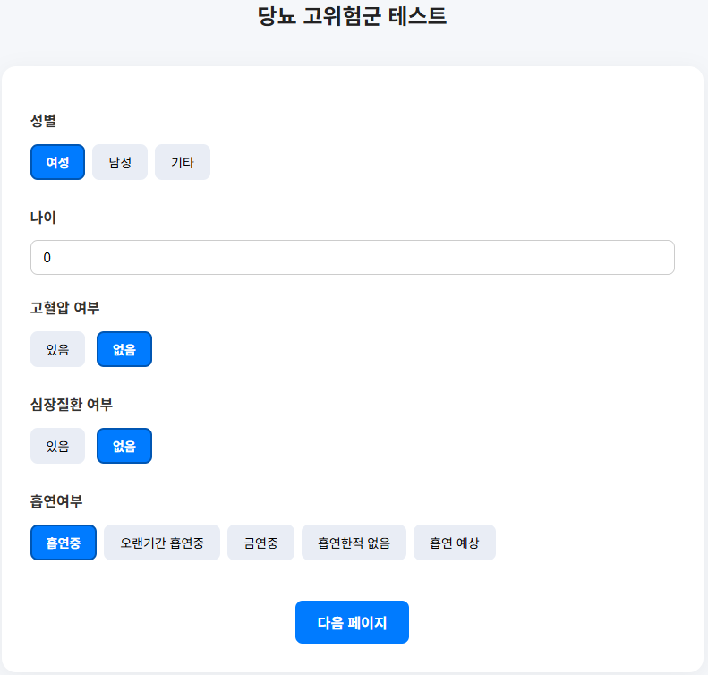

# 프로젝트 소개
1. KNN을 이용한 위치기반 식당 추천 서비스
2. 당뇨 고위험군 진단 설문 서비스
3. 낙서를 통한 대상 추론 서비스
4. 사전 학습된 디코더 모델 전이학습을 통한 커스텀된 챗봇 만들기

# 역할 분담
- 조원 이름 : 김송미, 오경석, 안슬기, 최상준
- 작업 내용

# 기능 설명
- 중요한 코드가 있으면 코드와 함께 설명
- 구현화면에 대한 이미지
- step1
- 
- step2
- 
- result
- 